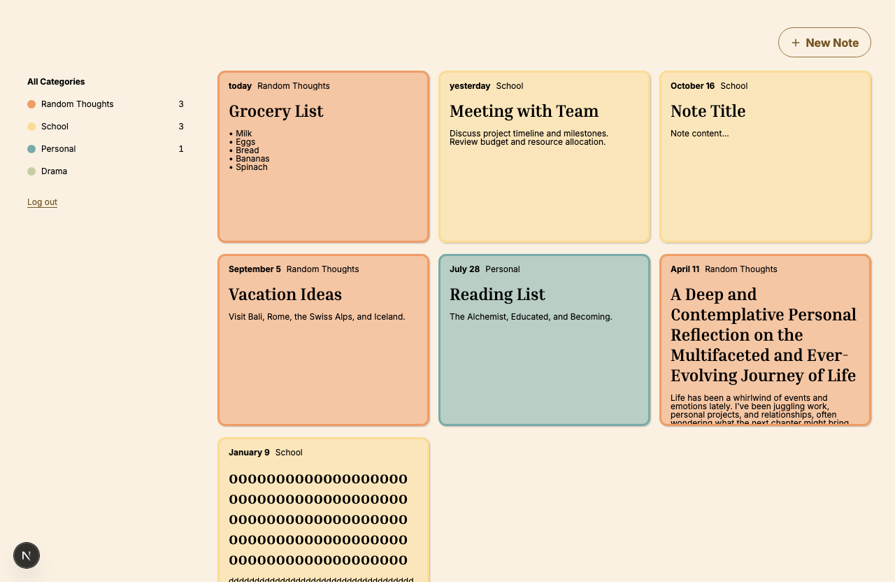
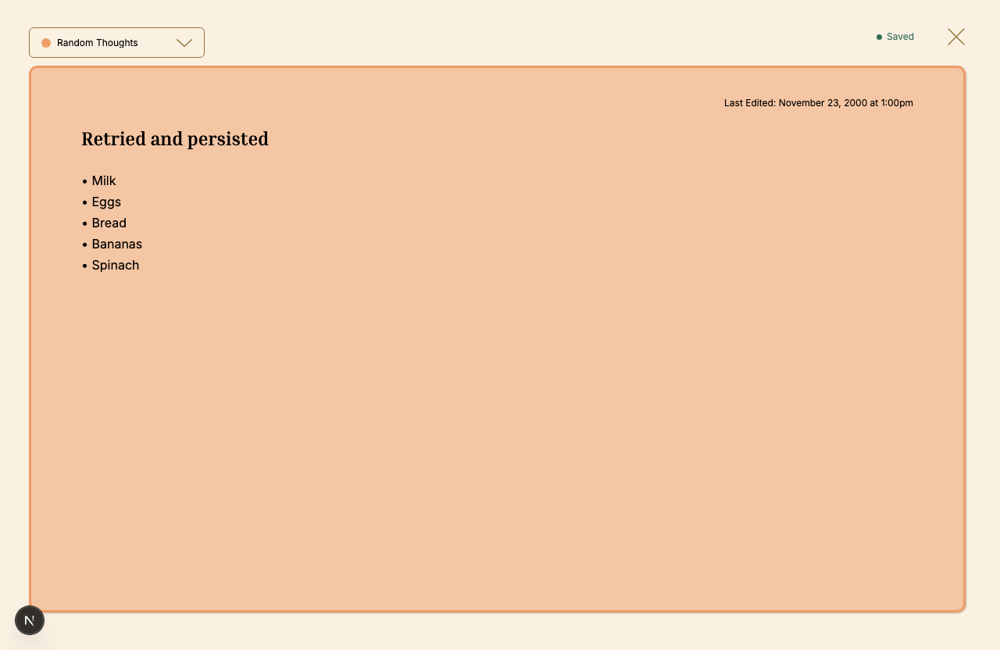

# Turbo Notes

Turbo Notes is a full-stack notes application for organizing and editing personal notes. Users can create an account, organize notes in four fixed categories, filter the notes grid, and edit with autosave.





## Features

- Email signup, login, logout, Django sessions, and CSRF protection.
- Random Thoughts, School, Personal, and Drama categories with note counts and filtering.
- Persistent blank-note creation and an empty state.
- Durable, idempotent note creation, so retries cannot duplicate or resurrect a note.
- Title, content, and category editing with debounced autosave.
- Strict revision checks that prevent stale or ambiguous overwrites.
- Recoverable browser-local drafts for interrupted saves.
- Opaque cursor pagination exposed as a simple **Load more** action.
- Responsive layouts optimized for mobile and desktop viewports.

## Architecture

The repository is a small monolith with two applications:

```text
apps/api/   Django 5.2 + Django REST Framework + PostgreSQL
apps/web/   Next.js 16 + React 19 + TanStack Query
```

The browser calls `/api/v1` on the same origin. Next.js forwards those requests to Django, allowing the application to use an `HttpOnly` session cookie and standard CSRF protection without browser-readable access tokens.

Django scopes every note query to the authenticated owner. The four fixed category keys are `TextChoices` values on each note, while the frontend catalog is the single owner of their labels, colors, and presentation order. Note updates include the last acknowledged revision and return a conflict instead of overwriting a newer revision. The OpenAPI schema is committed, and the frontend consumes generated TypeScript declarations through a small typed API layer.

The notes list uses an opaque composite cursor over last-edit time and note ID. The UI presents the next-page link as **Load more**, keeping responses bounded and avoiding offset drift when rows are inserted or removed.

Recoverable drafts are retained deliberately. Unsaved note text is stored in `localStorage`, namespaced by user and note, for up to seven days. A draft is removed after a successful save, and all Turbo Notes drafts are cleared whenever the app transitions to a signed-out state—including explicit logout and an expired session. This improves recovery while limiting cross-account exposure on a shared browser.

See [ARCHITECTURE.md](docs/ARCHITECTURE.md) for the main boundaries and tradeoffs.

## Run locally

Prerequisites: Docker, Python 3.13 with `uv`, Node.js 24, pnpm 10.34, and Make.

Create the local API environment file and bootstrap both applications from the repository root:

```bash
cp apps/api/.env.example apps/api/.env
make bootstrap
make dev-db
make api-migrate
make api-dev
```

Local Django settings load `apps/api/.env` without replacing variables already supplied by the process. Test and production settings never load this file.

Alternatively, Compose can migrate a fresh database and start the API as one dependency-ordered flow:

```bash
docker compose -f apps/api/compose.yaml up --build api
```

In another terminal, start the web application:

```bash
make web-dev
```

Open `http://localhost:3000`. The default local configuration forwards API requests to Django at `http://127.0.0.1:8000`.

## Verification

With PostgreSQL running and migrations applied, reproduce the complete CI verification:

```bash
make ci
```

The command surface can also run the faster checks and each boundary independently:

```bash
make check
make api-check
make web-check
make test
make schema-check
```

After an intentional API contract change, regenerate both committed artifacts with `make schema`.

The responsive browser suite covers the mobile base and each configured breakpoint at 390px, 600px (`sm`), 768px (`md`), and 1024px (`lg`) with a bounded worker count. To run the real Next.js → Django → PostgreSQL journey:

```bash
cd apps/web
pnpm test:e2e
pnpm test:fullstack
```

GitHub Actions runs the backend, frontend, responsive browser, and real full-stack checks.

## Deploy to Render

The committed `render.yaml` Blueprint provisions two free web services and a free PostgreSQL database in the same Render region. The Next.js service forwards same-origin `/api/v1` requests to Django through the API's Render-managed HTTPS URL, because free web services cannot receive private-network traffic. The Blueprint wires the public web origin into Django's CSRF allowlist.

Create a new Blueprint in Render, connect this repository, and apply `render.yaml`. Render generates the Django secret and database credentials automatically. On the free tier, the API runs migrations during service startup because separate pre-deploy commands require a paid service plan. Free web services spin down when idle, and free Render Postgres databases expire after 30 days.

For a production workload, select paid service and database plans, move migrations to `preDeployCommand`, configure backups and monitoring, and review scaling from measured traffic.

## Production boundary

Production settings fail closed unless a strong secret, explicit allowed hosts, and a PostgreSQL database URL are supplied. Paid production deployments should run migrations as a separate release step before starting Gunicorn; the free Render Blueprint documents its startup-time exception. Interactive Swagger documentation is local-only; the committed OpenAPI document remains the reviewable contract.

When TLS terminates at a reverse proxy, set `DJANGO_TRUST_X_FORWARDED_PROTO=true` only after that proxy is configured to strip client-supplied forwarding headers and set `X-Forwarded-Proto`. Otherwise, enforce HTTPS without trusting that header. Restrict direct API ingress when the deployment tier supports it, use verified database TLS outside a trusted private network, and expose health probes only to the orchestrator or load balancer. Authentication abuse controls and storage quotas should use a shared Redis/edge policy in a real deployment; an in-process DRF throttle would not be a reliable distributed security boundary.

## Design and scope

The application centers on a complete notes workflow: authentication, fixed categories, persistent blank-note creation, reopenable autosave, owner isolation, explicit failure states, responsive behavior, and focused automated coverage. The desktop layout establishes the primary visual hierarchy, while smaller layouts adapt its structure and touch targets for mobile devices.

The product scope is intentionally focused: search, rich text, sharing, custom categories, realtime collaboration, and password recovery are not currently included. The implementation favors framework defaults where additional operational machinery would not improve reliability or maintainability.

## AI usage

OpenAI Codex assisted with architecture exploration, backend and frontend implementation, test development, and reviews of accessibility, security, and failure behavior. AI-assisted changes were validated against the running application through code inspection and automated checks. Final product and implementation decisions were reviewed by the project maintainer.
